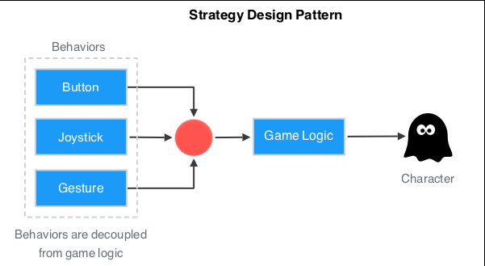
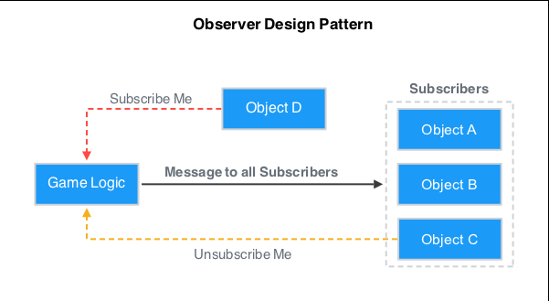
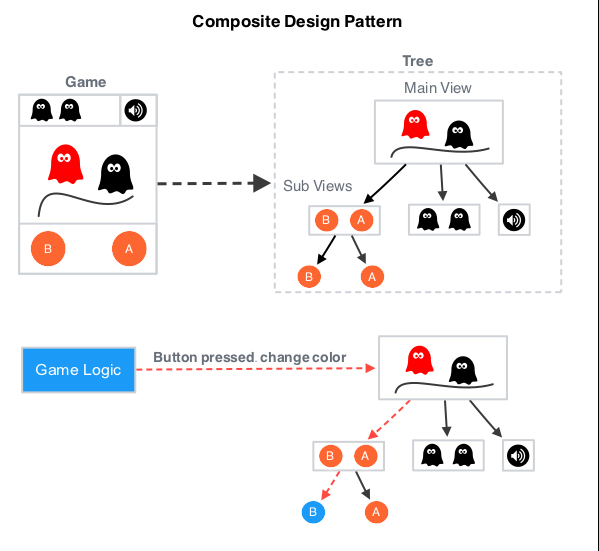
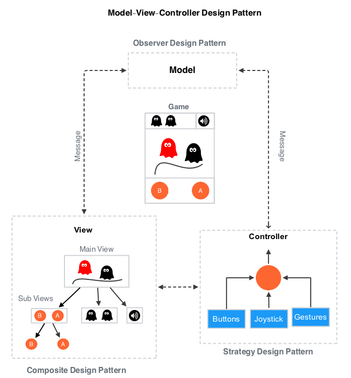
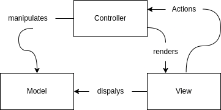
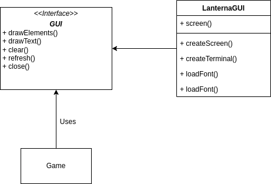
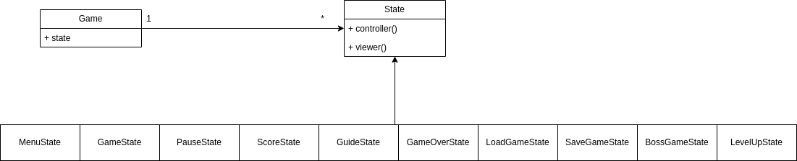

## LDTS_<T><G> - Space Escape

> Space Escape is a game inspired by games like space invaders, but we some diferent ideas, here you land on a planet and soon you realise not only its habitated aswell its hostile. Your goal is to survive and in order to acomplish that you need to get past an asteroid field in order to be able to grav jump to your home planet, while being followed by enemies from every where!

**Game Objective**:

In this world you are a space ship that can shot or avoid asteroids
while killing enemies and earn points!
some asteroids will drop some goods or upgrades,
so you should not only avoid them ;)
Your main objective is to grav jump to your home planet, try to survive till that.

Developed by
- **Andre David Aires de Freitas** (up202007189)
- **Gonçalo Guimaraes Goncalves de Morais Figueira** (up202108804)

LDTS 2023⁄24 
Software Design and Testing Laboratory
### IMPLEMENTED FEATURES

> This is a list of the implemented features of the game

- **Main Menu** - The game has a main mainMenu, that can be accessed by pressing the escape key. The main mainMenu has
  the following options:
  - **New Game** - Starts a new game.
  - **Load Game** - Starts the game in the previous scene, paused.
  - **Scores** - Displays the scores of the game
  - **Instructions** - Displays the instructions of the game.
  - **Exit** - Exits the game.
- **Pause Screen** - The game can be paused by pressing the escape key, and the game can be resumed by selecting the 'Resume' option in the menu. The player can also exit the game by selecting the 'Exit' option and restart the game by selecting the 'Restart' option.
- **Game Over Screen** - The game displays a game over screen when the player reaches 0 hp, the score of the player and the distance achieved will be stored in the scores.

### PLANNED FEATURES

> This section is similar to the previous one but should list the features that are not yet implemented. Instead of screenshots you should include GUI mock-ups for the planned features.

- **Player** - The game as a playable character, wich is a space ship. The player can be controlled by using reserved keys:
  - **Movement** - The player can move by pressing "a" key the player moves right, and by pressing "d" key the player move left, the player also as a special move the slide, you can performe that by pressing "shift", this ability has a cooldown, the player becames untouchable during a short time.
  - **Shot** - The player as the hability to shot by pressing the "j" key, and also he can drop bombs by pressing "k" key.
  - **Xp levels** - The player as a level system where he gains xp by killing enemies, when he levels up he will recieve an upgrade.
  - **Health** - The player will display an health bar with his current health.
- **Upgrades** - The player can receive some upgrades while playing by destroying asteroids or by gaining enought xp from killing enemies to level up:
  - **Damage up** - Each shot deals more damage, this increases in a linear fation.
  - **Health up** - Encrease max Hp if the player is at max Health, else restore the player health to max.
  - **Multi shot** - Shot balls in multiple directions, based on upgrade level.
  - **Burst shot** - When pressing the shot key the player will shot multiple sequencial shots, based on level.
  - **Shoting speed** - Increase shoting speed in a linear fation.
  - **Speed Boost** - Increase minimaly the speed of the player.
  - **Slider** - Decreases the cooldown of the silding hability.
- **Scores** - The game keeps track of the top 5 scores, and displays them in a leaderboard, ordered by descending order of score.
- **Random asteroids** - The asteroids are generated with a random distance between themselves, the size is also random, but the odds of getting a bigger asteriod are smaller, by progressing the game, the asteroids will spwan faster.
- **Background music** - The game has background music, that can be turned on and off by pressing the 'm' key. The music is different for the menus and the game.
- **Sound effects** - The game has sound effects. The sound effects can be turned on and off by pressing the 's' key.
- **Collision Detection** - The game detects collisions between the player and the asteroids and the shots from the enemies, and also from the player and coletables.
- **Colectables** - The player can collect some objetcts to increase his power in the game:
  - **Dropables** - This are objects that rarely drop from the asteroids, they simply are upgrades.
- **Enemies**
  - **mosquito** - This enemie is a fast pace small space ship with low hp and low damage, but fast shooting speed
  - **corvet** - This is a balanced space ship, with average shooting speed, hp and size.
  - **tanker** - This is a big space ship with high Hp, but slow in speed and shooting speed, the damage is average.

### MOCKUPS

> PRINTS AND GIFS OF THE GAME FEATURES

### DESIGN

#### SpaceEscape code structure

### UML
> MERGE ALL UMLS

**Problem in Context**
There are a lot of critical classes in the implementation of this project and with the increase in complexity of each class relation, so the **maintainability** was a big concern in while devoloping this project, also when incrementing the inputs in the **game logic** we found that every input must provide the same data to the game logic, furthermore adding or removing an input controller should not crash a game, with this in mind we need to find a pattern to organize and solve this problem.

**The Pattern**

We used Model-View-Controller design pattern to solve this problem, this model is made up of three patterns:

- **Strategy Design Pattern** - In a game, you should always decouple the interaction between the input controller and the game's logic. The game's logic should receive the same kind of input regardless of the input controller (button, gesture, joystick).
  Although each input controller behaves differently to the user, they must provide the same data to the game's logic. Furthermore, adding or removing an input controller should not crash a game.
  This decoupling behavior and flexibility are possible thanks to a design pattern known as Strategy Design Pattern. This design pattern provides flexibility to your game by allowing it to change behavior dynamically without the need of modifying the game's logic.

- **Observer Design Pattern** - In a game, all of your classes should be loosely coupled. This means that your classes should be able to interact with each other, but have little knowledge of each other. Making your classes loosely coupled makes your game modular and flexible to add features without adding unintended bugs.
  This pattern is normally implemented when an object wants to send messages to its subscriber (other objects). The object does not need to know anything about how the subscribers work, just that they can communicate.

- **Composite Design Pattern** - A game normally consists of many views. There is the main view where the characters are rendered. There is a sub-view where player's points are shown. There is a sub-view which shows the time left in a game. If you are playing the game on a mobile device, then each button is a view.
  Maintainability should be a major concern during game development. Each view should not have different function names or different access points. Instead, you want to provide a unified access point to every view, i.e., the same function call should be able to access either the main view or a sub-view.
  This unified access point is possible with a Composite Design Pattern. This pattern places each view in a tree-like structure, thus providing a unified access point to every view. Instead of having a different function to access each view, the same function can access any view.

As shown in the illustration above, the Strategy pattern represents the Controller part of the MVC. The strategy pattern decouples user inputs from the game's logic (Model) and interfaces (View).

The Composite Design Pattern represents all Views (main window & buttons) in an application. This pattern provides a unified access point for all views to the model.

The Observer Design Patten represents the logic of your application (Model). Through this pattern, the Model is able to interact with the views and controllers without knowing anything about them. This pattern makes the interaction between all classes loosely coupled.

**Implementation**

The following figure shows how the pattern’s roles were mapped to the application classes.

These packages can be found in the following folders:

- [Model](../src/main/java/LDTS/SpaceEscape/Model)
- [View](../src/main/java/LDTS/SpaceEscape/View)
- [Controller](../src/main/java/LDTS/SpaceEscape/Controller)

**Consequences**

A modular structure of the code allowing us to divide the code in different files can be very usefull for many reasons,
but it can also not be an easy task to do. This means that when we are developing the code we need to think about the
structure of the code and how we are going to divide it. This is, in fact, a problem for people who aren't used to work with this
kind of structure. However, as the times goes on we will get used to it and benefit from it.

#### Lanterna Library Facade

**Problem in Context**

The game shouldn't depend on the specific implementation of the GUI library (Lanterna). The application UI framework
should be easily interchangeable without affecting the rest of the code.

**The Pattern**

The Facade pattern was ideal for this problem as it provides a unified interface to a set of diverse interfaces in a
chose library. This way, the rest of the code doesn't need to know the specifics of the library, and can be easily
changed.

**Implementation**

These classes can be found in the following files:

- [GUI](../src/main/java/LDTS/SpaceEscape/GUI/GUI.java)
- [LanternaGUI](../src/main/java/LDTS/SpaceEscape/GUI/LanternaGUI.java)
- [Game](../src/main/java/LDTS/SpaceEscape/Model/game)

**Consequences**

By declaring a unified interface, the code is more readable and maintainable.
Another point is that we only need to implement the methods that we need and not the whole GUI library.
The code is also more flexible by the possibility of changing the GUI library.

#### Game State

**Problem in Context**

It easy to see that the whole game has several states, such as the main menu, the game itself, the game over screen,
scores screen, etc. So, the program should be able to handle these states in a simple and efficient way.
Also, we need to easily change the game state when the user interacts with the game. For example, if the player has died,
the game state should be set to the game over screen.

**The Pattern**

The State pattern allows the program to change the behavior of the application depending on the current state. For
example, the main controller and viewer is defined depending on the current state and each state has its own controller
and viewer.
Also, the fame can easily change the state by calling the setState method.

**Implementation**

**Consequences**

The game state is defined in the Game class. This is usefull because we can change the state of the game by calling the
setState method.
The downside is that we need to have access to the Game class context in order to use the setState method.

------

#### KNOWN CODE SMELLS

> This section should describe 3 to 5 different code smells that you have identified in your current implementation.

### TESTING

- Screenshot of coverage report.
- Link to mutation testing report.

### SELF-EVALUATION

> In this section describe how the work regarding the project was divided between the students. In the event that members of the group do not agree on a work distribution, the group should send an email to the teacher explaining the disagreement.

**Example**:

- John Doe: 40%
- Jane Doe: 60%

